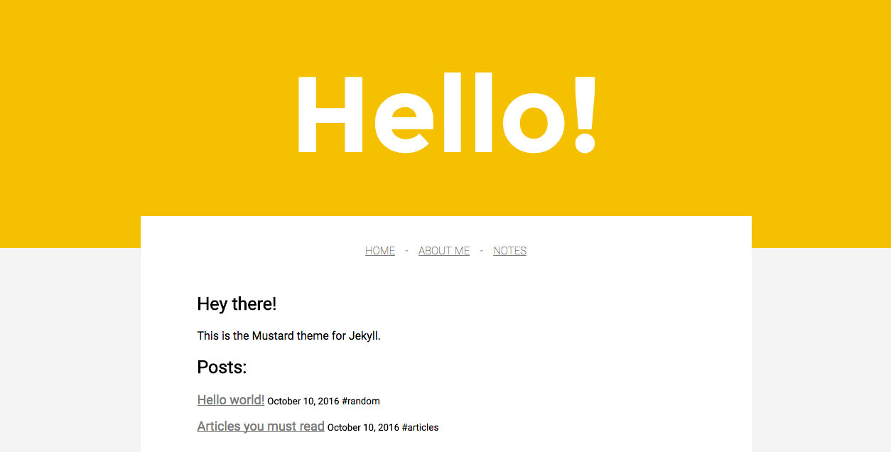

# Mustard theme for Jekyll

Hello!

I was designing from scratch a Jekyll theme for my personal site and I thought it could be useful to others, so here I am publishing the basic files you need if you like it or if you want to contribute and make it better.

## How to use the Mustard theme

The current template has 3 main pages: a home page, an "about me" page, and a blog.

WIP.

## Preview

